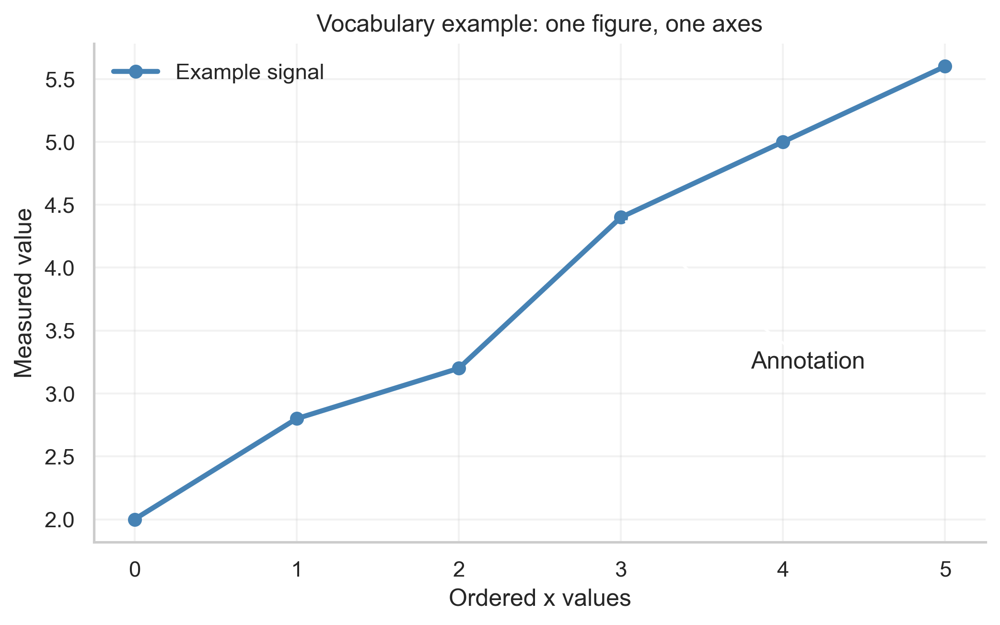
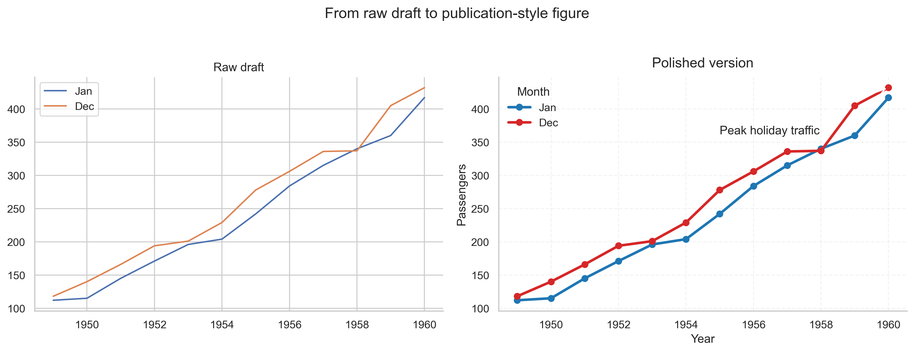

# Overall Plotting Notes

These notes are written for a beginner who wants to become comfortable with plotting, not just copy commands.
The goal is to help you understand what a plot is doing, why a plot type is chosen, and how to improve a plot
step by step until it is ready for a report, presentation, or paper.

If you remember only one idea from this file, remember this:

> A good plot is a visual answer to a question.

That means plotting starts with a question, not with a favorite library.

## How to Use These Notes

- Read this file first.
- Keep the notebook open beside these notes: `notebooks/01_plotting_walkthrough.ipynb`.
- Copy snippets into the notebook after the setup and dataset-loading sections.
- When you see a plot image below, open the matching figure file in `outputs/figures/` and compare it with the code in the notebook.

## The Fastest Mental Model

Think of plotting like building a labeled poster:

- **Figure** = the full page or canvas.
- **Axes** = one chart area on that page.
- **Data** = the numbers or categories you want to show.
- **Marks** = the visual things you draw: points, lines, bars, boxes, text.
- **Labels and legends** = the text that makes the plot understandable.

A plot without labels is like a map without street names.

## Figure, Axes, and Subplots

Here is the most important vocabulary to learn early:

| Term | Simple meaning | Easy way to remember |
| --- | --- | --- |
| Figure | The whole image | The full page |
| Axes | The region where one chart is drawn | One chart box |
| Axis | The x-axis or y-axis line and scale | One direction of measurement |
| Subplot | One axes inside a grid of several axes | One panel in a multi-panel figure |
| Legend | A guide to colors or marker types | The decoder |
| Annotation | Extra text or arrows on the plot | A note stuck onto the chart |

```python
fig, ax = plt.subplots(figsize=(7, 4))
ax.plot(x, y)
ax.set_title("One figure, one axes")
```

What this code means:

- `fig` is the whole canvas.
- `ax` is the one chart area you are drawing on.
- `ax.plot(...)` adds a line to that chart area.



How else you could use the same idea:

- Replace the line with a scatter plot if the x values are not naturally connected.
- Replace one axes with several subplots if you need side-by-side comparisons.
- Add annotations when one point or one region needs attention.

## Start with the Question, Not the Syntax

Before you write plotting code, ask:

1. What am I trying to show?
2. What columns hold that information?
3. Is the x-axis ordered, numeric, or categorical?
4. Do I need to show raw values, summaries, or uncertainty?
5. Will the reader care more about comparison, distribution, or relationship?

A few common question-to-plot matches:

| Question | Good plot types | Why |
| --- | --- | --- |
| How does a value change over time? | Line plot | Time is ordered, so a line makes sense |
| Do two numeric variables move together? | Scatter plot | Points show relationship and outliers |
| How do categories compare on average? | Bar plot or point plot | Easy category-to-category comparison |
| How are values distributed? | Histogram, KDE, box plot, violin plot | These show shape, spread, and skew |
| How do many variables relate at once? | Heatmap, correlation heatmap, multi-panel figure | Good for structured comparisons |

## Understand the Data Before You Plot It

Beginners often jump straight to plotting and then get confused by missing values, strange labels, or unexpected scales.
A quick data check saves time.

```python
iris.head()
iris.dtypes
iris.isna().sum()
iris.describe(include="all")
```

What each line does:

- `head()` shows the first few rows so you can see column names and values.
- `dtypes` tells you which columns are numeric and which are text-like categories.
- `isna().sum()` tells you where missing values exist.
- `describe(...)` gives summary statistics so you know the rough scale.

Beginner rule:

- If you do not understand the columns yet, you are not ready to plot them.

## Common Data Shapes

Plot choice depends heavily on data shape.

| Data shape | Example columns | Good first plot |
| --- | --- | --- |
| One numeric column | `tip`, `mean radius` | Histogram |
| One category + one numeric column | `day` + `total_bill` | Box plot or bar plot |
| Two numeric columns | `sepal_length` + `petal_length` | Scatter plot |
| One ordered x + one numeric y | `year` + `passengers` | Line plot |
| Matrix / pivot table | `month x year` passenger counts | Heatmap |
| High-dimensional features | many gene or image features | PCA or UMAP-like embedding |

## The Basic Plotting Workflow

Use this workflow every time:

1. Inspect the data.
2. Choose the simplest correct plot type.
3. Make a rough version quickly.
4. Check labels, scales, category order, and missing values.
5. Polish colors, spacing, title, legend, and export settings.
6. Save the final figure and inspect the saved file outside the notebook.

```python
fig, ax = plt.subplots(figsize=(8, 4.5))
ax.scatter(iris["sepal_length"], iris["petal_length"], alpha=0.7, s=60)
ax.set(
    title="Sepal length vs petal length",
    xlabel="Sepal length (cm)",
    ylabel="Petal length (cm)",
)
ax.grid(alpha=0.2)
fig.savefig("outputs/figures/example.png", dpi=300, bbox_inches="tight")
```

Why this snippet is a strong beginner pattern:

- It creates the figure explicitly.
- It labels both axes clearly.
- It uses light transparency.
- It saves the plot at export quality.

## Titles, Labels, Legends, and Ticks

These are not small details. They are part of the meaning of the plot.

### Titles

Weak title:

- `Scatter plot`

Better title:

- `Sepal length and petal length differ clearly by iris species`

Good titles tell the reader what to look for.

### Axis Labels

Good axis labels answer:

- what is being measured?
- in what units?

Better:

- `Petal length (cm)`

Worse:

- `petal_length`

### Legends

Use a legend when color, marker shape, or line style carries information.

Do not use a legend when:

- the plot has only one group
- the labels are already obvious
- the legend repeats information printed directly on the figure

### Ticks

Ticks are the scale marks.

Good tick habits:

- avoid too many tick labels
- keep them readable
- rotate them only when necessary
- use sensible numeric precision

## Color, Alpha, and Visual Weight

Visual weight means how much attention a plot element pulls.

| Setting | What it changes | Beginner advice |
| --- | --- | --- |
| `color` | The main color of a mark | Use it to encode meaning, not decoration |
| `alpha` / `opacity` | Transparency | Lower it when points overlap |
| `linewidth` | Thickness of lines | Increase slightly for presentation plots |
| `s` / `size` | Marker size | Keep large enough to see, small enough to avoid clutter |

```python
ax.scatter(
    iris["sepal_length"],
    iris["petal_length"],
    color="steelblue",
    s=70,
    alpha=0.65,
)
```

Simpler explanation:

- `color` tells the eye where to look.
- `alpha` helps when many points sit on top of each other.
- marker size should support the data, not dominate it.

## Figure Size, DPI, and Export

These settings matter most when the plot leaves the notebook.

| Concept | Meaning | Typical beginner choice |
| --- | --- | --- |
| `figsize` | Canvas size in inches | `(6, 4)` or `(8, 5)` |
| `dpi` | Dots per inch for raster images | `300` for final PNG |
| `bbox_inches="tight"` | Trims extra whitespace | Usually a good idea |

```python
fig.savefig("outputs/figures/final_plot.png", dpi=300, bbox_inches="tight")
fig.savefig("outputs/figures/final_plot.svg", bbox_inches="tight")
fig.savefig("outputs/figures/final_plot.pdf", bbox_inches="tight")
```

When to use which format:

- **PNG**: slides, chat, notebooks, quick sharing
- **SVG**: web and vector editing
- **PDF**: papers and print workflows
- **HTML**: interactive Plotly output

## A Real Example: From Basic to Polished

The figure below is useful because it shows the same data before and after polishing.



What improved on the polished side:

- clearer title
- axis labels added
- stronger line styling
- cleaner legend
- subtle grid
- annotation for the key point

How else you could use the same idea:

- apply the same polish steps to a scatter plot
- improve a heatmap with better labels and color choices
- improve a bar plot by using better category order and removing clutter

## When a Plot is Probably the Wrong Plot

A plot is probably a poor choice if:

- you need a very long caption just to explain what the axes mean
- a bar plot is hiding a wide or messy distribution
- categories are too many to compare comfortably
- the plot looks crowded before labels are even added
- the same message would be clearer in a different plot type

Beginner shortcut:

- if you are unsure, make both a summary plot and a raw-data plot
- for example: bar plot plus strip plot, or box plot plus swarm plot

## A Beginner Practice Plan

If you want to get comfortable quickly:

1. Make one line plot from `flights`.
2. Make one scatter plot from `iris`.
3. Make one histogram from `breast_cancer`.
4. Make one box plot from `tips`.
5. Rebuild one of them with better labels, title, and export settings.

This sequence works because it teaches:

- ordered data
- numeric relationships
- distributions
- category comparisons
- final polishing

## Official Documentation Links

These notes were expanded using the official library documentation:

- [Matplotlib user guide](https://matplotlib.org/stable/users/index.html)
- [Matplotlib quick start](https://matplotlib.org/stable/users/explain/quick_start.html)
- [Seaborn tutorial](https://seaborn.pydata.org/tutorial.html)
- [Plotly Python documentation](https://plotly.com/python/)
