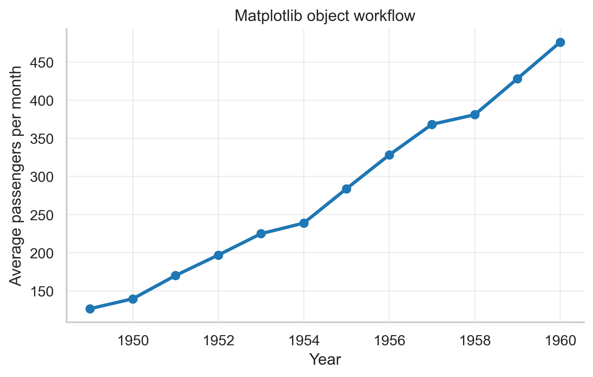
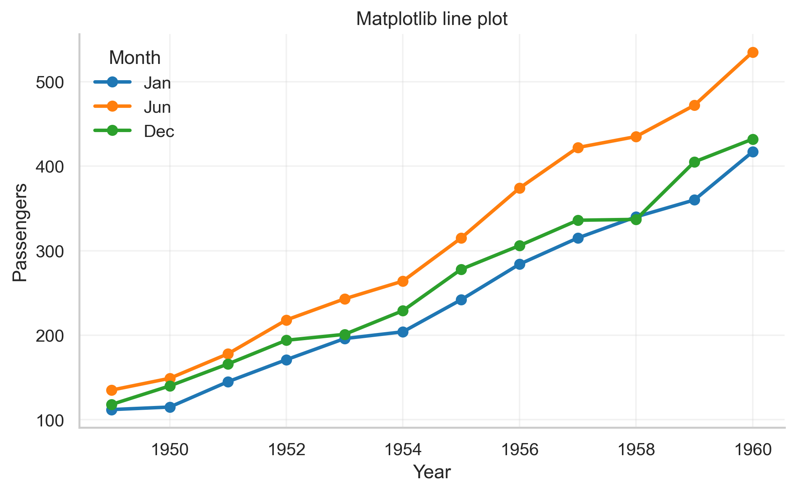
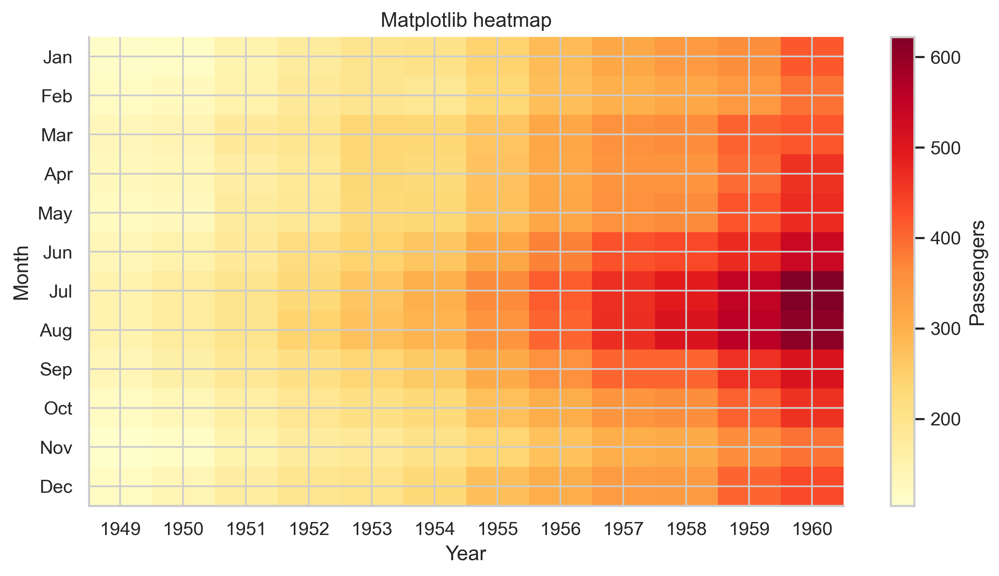

# Matplotlib Notes

Matplotlib is the library to learn when you want to understand what is really happening in a plot.
Even if you later use Seaborn or Plotly more often, learning Matplotlib makes the rest of the plotting
ecosystem easier to understand.

The official Matplotlib documentation strongly emphasizes the object-oriented workflow. For beginners,
this means:

> Create a figure and axes first, then draw on the axes.

## What Matplotlib Is Good At

- publication figures
- multi-panel layouts
- exact label and annotation placement
- custom styling
- exporting clean static images

## The One Pattern to Learn First

```python
fig, ax = plt.subplots(figsize=(7, 4))
ax.plot(x, y, color="steelblue", linewidth=2)
ax.set(title="My first Matplotlib plot", xlabel="X", ylabel="Y")
```

Why this pattern matters:

- `plt.subplots(...)` creates the canvas and plotting area.
- `ax.plot(...)` draws the marks.
- `ax.set(...)` labels the chart clearly.

If you only learn one Matplotlib pattern this week, learn that one.



How else you could use this exact pattern:

- swap `ax.plot(...)` for `ax.scatter(...)`
- add a second line with another `ax.plot(...)`
- replace the single axes with a grid of axes using `plt.subplots(2, 2, ...)`

## Core Vocabulary

| Object | What it is | Why you care |
| --- | --- | --- |
| `Figure` | The whole image | Controls overall canvas and saving |
| `Axes` | One chart area | Where most plotting work happens |
| `Axis` | One scale direction | Controls ticks and limits |
| `Artist` | Any visible element | Lines, text, bars, legends, and more |

Simpler explanation:

- the **figure** is the page
- the **axes** is the chart box
- the **artists** are everything you can see inside or around the chart

## Most Important Functions

| Function | What it does | When beginners use it |
| --- | --- | --- |
| `plt.subplots` | Creates figure and axes | Almost every plot |
| `ax.plot` | Draws a line | Ordered or time data |
| `ax.scatter` | Draws points | Two numeric variables |
| `ax.bar` | Draws bars | Category summaries |
| `ax.hist` | Draws histogram bins | Distribution checks |
| `ax.imshow` | Displays a matrix as colored cells | Heatmaps or image-like data |
| `ax.errorbar` | Adds uncertainty bars | Means with SD, SE, or CI |
| `ax.annotate` | Adds text plus optional arrow | Highlight key findings |
| `fig.savefig` | Exports the figure | Final sharing and publication |

## How to Use the Table Above

Read it in layers:

- `subplots` creates the place where the chart will live.
- the middle functions draw data.
- `annotate` and label methods explain the plot.
- `savefig` turns notebook work into a reusable file.

## Minimal Setup Snippet

These notes assume you already ran the notebook setup cell. If you want the smallest standalone Matplotlib setup, this is enough:

```python
from pathlib import Path
import pandas as pd
import matplotlib.pyplot as plt

project_root = Path.cwd().resolve()
iris = pd.read_csv(project_root / "data" / "raw" / "iris.csv")
```

## First Useful Plot: Scatter

```python
fig, ax = plt.subplots(figsize=(7, 5))
ax.scatter(
    iris["sepal_length"],
    iris["petal_length"],
    s=60,
    alpha=0.7,
    color="steelblue",
    edgecolor="white",
    linewidth=0.5,
)
ax.set(
    title="Sepal length vs petal length",
    xlabel="Sepal length (cm)",
    ylabel="Petal length (cm)",
)
ax.grid(alpha=0.2)
```

What each important line does:

- `figsize=(7, 5)` gives the plot enough room.
- `s=60` controls marker size.
- `alpha=0.7` prevents dense point overlap from becoming too dark.
- `edgecolor="white"` separates nearby points visually.
- `ax.set(...)` applies title and axis labels in one place.


Other good uses of the same pattern:

- PCA coordinates
- embedding plots
- model score versus model complexity

## Line Plots in Matplotlib

Use a line plot when the x-axis has a real order: time, dose, cycle number, distance, or rank.

```python
fig, ax = plt.subplots(figsize=(8, 4.5))
ax.plot(
    flights_by_year["year"],
    flights_by_year["passengers"],
    marker="o",
    linewidth=2.2,
    color="#1f77b4",
)
ax.set(title="Passengers over time", xlabel="Year", ylabel="Passengers")
```

Beginner warning:

- do not connect categories like `setosa`, `versicolor`, and `virginica` with a line
- a line suggests order and continuity



## Histograms, Heatmaps, and Error Bars

These three plot families teach very different habits.

### Histogram

```python
fig, ax = plt.subplots(figsize=(8, 4.5))
ax.hist(breast_cancer["mean radius"], bins=20, color="#4c72b0", edgecolor="white")
ax.set(title="Distribution of mean radius", xlabel="Mean radius", ylabel="Count")
```

Use this when you want:

- shape
- spread
- skew
- rough frequency

### Heatmap-like matrix

```python
fig, ax = plt.subplots(figsize=(10, 5))
image = ax.imshow(flights_pivot.values, cmap="YlOrRd", aspect="auto")
fig.colorbar(image, ax=ax, label="Passengers")
ax.set_title("Passengers by month and year")
```

Use this when:

- you have a row-column grid
- color is the most efficient way to show magnitude



### Error bars

```python
fig, ax = plt.subplots(figsize=(7.5, 4.5))
ax.errorbar(
    error_summary["condition"],
    error_summary["mean_count"],
    yerr=error_summary["se_count"],
    fmt="o-",
    capsize=5,
)
```

Use this when:

- you already have a summary value
- you also want to show uncertainty or variability


## Important Parameters

| Parameter | What it changes | Beginner meaning |
| --- | --- | --- |
| `figsize` | Canvas size | How big the plot will feel |
| `color` | Main color | What visual emphasis the plot has |
| `linewidth` / `lw` | Line thickness | How heavy or light a line looks |
| `marker` | Point symbol | How line points or groups are marked |
| `alpha` | Transparency | How much overlap is visible |
| `s` | Scatter point size | How large each point looks |
| `cmap` | Color map for matrices or numeric color | How magnitude is translated into color |
| `xlim`, `ylim` | Axis limits | How zoomed-in or zoomed-out the plot looks |
| `dpi` | Raster resolution | How sharp the saved image is |

### Code Example Using Several Parameters Together

```python
fig, ax = plt.subplots(figsize=(8, 5))
ax.scatter(
    iris["sepal_length"],
    iris["petal_length"],
    s=80,
    alpha=0.65,
    color="#4c72b0",
    edgecolor="white",
    linewidth=0.6,
)
ax.set_xlim(4, 8)
ax.set_ylim(1, 7)
ax.grid(alpha=0.2)
fig.savefig("outputs/figures/custom_scatter.png", dpi=300, bbox_inches="tight")
```

Why this example is useful:

- it shows visual control without becoming complicated
- every setting changes something a beginner can see immediately

## Multi-panel Figures

Multi-panel figures are one of Matplotlib's strongest areas.

```python
fig, axes = plt.subplots(2, 2, figsize=(11, 8))
axes[0, 0].plot(...)
axes[0, 1].scatter(...)
axes[1, 0].hist(...)
axes[1, 1].boxplot(...)
fig.tight_layout()
```

Good beginner habit:

- make sure each panel answers a related question
- keep labeling style consistent across all panels


## When to Choose Matplotlib Over the Others

Choose Matplotlib when:

- you need exact control
- you are making a publication figure
- you want unusual layouts
- you want to learn the underlying plotting model well

Use Seaborn instead when:

- your data is already tidy in a dataframe
- you want quicker grouped plots

Use Plotly instead when:

- hover, zoom, or interactive HTML matters

## Common Mistakes

- Mixing `plt.*` and `ax.*` calls without knowing why.
- Forgetting labels and units.
- Saving only screenshots instead of saving from code.
- Using default styles without checking readability.
- Making bars when a box plot or strip plot would be more honest.

## A Simple Beginner Practice Sequence

1. Make one scatter plot.
2. Make one line plot.
3. Make one histogram.
4. Add labels and a legend.
5. Save each plot as PNG.
6. Rebuild one plot as a 2x1 or 2x2 panel figure.

## Official Documentation Links

- [Matplotlib quick start](https://matplotlib.org/stable/users/explain/quick_start.html)
- [Matplotlib figure and axes explanation](https://matplotlib.org/stable/users/explain/figure/api_interfaces.html)
- [Matplotlib pyplot tutorial](https://matplotlib.org/stable/tutorials/pyplot.html)
- [Matplotlib saving figures](https://matplotlib.org/stable/api/_as_gen/matplotlib.pyplot.savefig.html)
