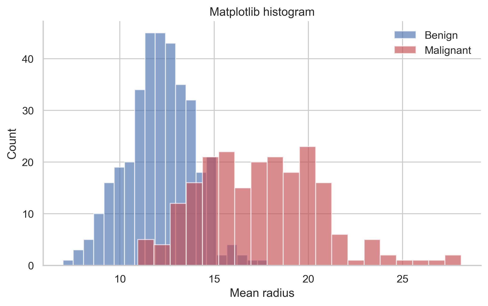
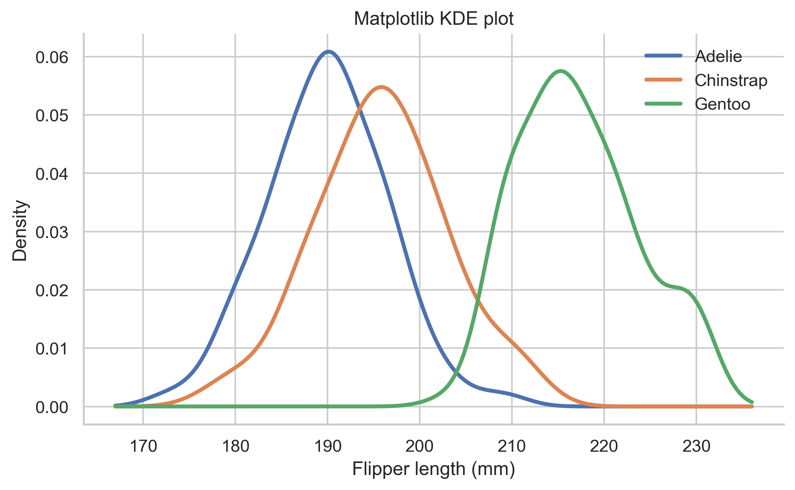
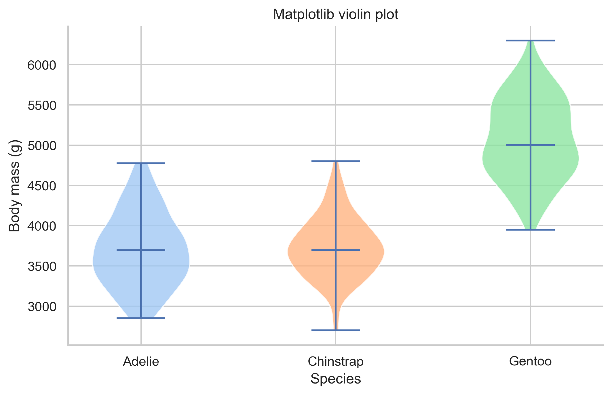

# Seaborn Notes

Seaborn is the fastest library in this project for making attractive statistical plots from pandas dataframes.
It sits on top of Matplotlib, which means:

- Seaborn gives you cleaner defaults.
- Matplotlib still handles much of the final polishing.

The official Seaborn tutorial emphasizes two big ideas that matter to beginners:

1. work with tidy dataframes
2. map dataframe columns to visual meaning

## The Beginner Mental Model

A Seaborn call often reads like a sentence:

```python
sns.scatterplot(data=iris, x="sepal_length", y="petal_length", hue="species")
```

Read it like this:

- take the dataframe `iris`
- put `sepal_length` on the x-axis
- put `petal_length` on the y-axis
- color points by `species`

That readability is one of Seaborn's biggest strengths.

## What Tidy Data Means

Tidy data usually means:

- each row is one observation
- each column is one variable
- each cell is one value

Example:

| species | sepal_length | petal_length |
| --- | --- | --- |
| setosa | 5.1 | 1.4 |
| versicolor | 7.0 | 4.7 |

Why tidy data helps:

- Seaborn can use column names directly
- grouping by color or style becomes easier
- faceting and summaries work more naturally

## The One Pattern to Learn First

```python
sns.set_theme(style="whitegrid")
ax = sns.scatterplot(
    data=iris,
    x="sepal_length",
    y="petal_length",
    hue="species",
    s=80,
)
ax.set(title="Iris scatter plot", xlabel="Sepal length (cm)", ylabel="Petal length (cm)")
```

Why this pattern is beginner-friendly:

- `data=` holds the whole dataframe
- `x=` and `y=` take column names
- `hue=` maps a grouping column to color
- `ax.set(...)` keeps labeling explicit


Other ways to use the same pattern:

- replace `hue="species"` with `style="species"`
- use `size=` for a third numeric variable
- use the same layout for PCA or embedding coordinates

## Axes-level vs Figure-level Functions

This is one of the most important Seaborn ideas.

| Type | Examples | What it means |
| --- | --- | --- |
| Axes-level | `scatterplot`, `lineplot`, `histplot`, `boxplot` | Draws on one Matplotlib axes |
| Figure-level | `relplot`, `displot`, `catplot`, `lmplot` | Builds the whole figure for you |

Simple explanation:

- axes-level functions are easier when you want one chart
- figure-level functions are easier when you want multiple panels

```python
# Axes-level
ax = sns.scatterplot(data=iris, x="sepal_length", y="petal_length", hue="species")

# Figure-level
g = sns.relplot(data=iris, x="sepal_length", y="petal_length", hue="species", col="species")
```

Use axes-level first as a beginner. Add figure-level functions once you are comfortable.

## Most Important Functions

| Function | What it does | Good beginner use |
| --- | --- | --- |
| `sns.scatterplot` | Scatter plot with grouping options | Numeric relationships |
| `sns.lineplot` | Line plot with grouping | Time or ordered data |
| `sns.barplot` | Aggregated bar plot | Category means or summaries |
| `sns.histplot` | Histogram | Single-variable distribution |
| `sns.kdeplot` | Smoothed density | Distribution shape |
| `sns.boxplot` | Box-and-whisker summary | Spread by category |
| `sns.violinplot` | Density-shaped category comparison | Full distribution shape |
| `sns.heatmap` | Colored matrix view | Heatmaps and correlations |
| `sns.pointplot` | Summary points with error bars | Means with uncertainty |

## Important Parameters

| Parameter | What it means | How beginners use it |
| --- | --- | --- |
| `data` | Whole dataframe | Start here |
| `x`, `y` | Column names for axes | Main variables |
| `hue` | Group to color by | Compare categories |
| `style` | Group to marker or line style | Extra separation when color is not enough |
| `size` | Numeric or grouped marker size | Third variable when used carefully |
| `palette` | Color palette | Cleaner grouping colors |
| `errorbar` | Uncertainty or spread display | Mean plus SE or CI |
| `estimator` | How grouped data is summarized | Mean by default in many places |
| `fill` | Whether densities or violins are filled | Distribution styling |

### Code Example Using `hue`, `style`, and `palette`

```python
ax = sns.scatterplot(
    data=iris,
    x="sepal_length",
    y="petal_length",
    hue="species",
    style="species",
    palette="Set2",
    s=85,
)
ax.set_title("Using color and marker style together")
```

How to think about these settings:

- `hue` answers "which color should each group get?"
- `style` answers "which marker shape should each group get?"
- `palette` answers "what set of colors should I use?"

## Distribution Plots

Seaborn is especially strong for distributions.

### Histogram

```python
ax = sns.histplot(
    data=breast_cancer,
    x="mean radius",
    hue="target_name",
    bins=20,
    alpha=0.55,
    element="step",
)
```

Use this when you want:

- counts by range
- distribution comparison by group
- a quick first look at scale and skew



### KDE plot

```python
ax = sns.kdeplot(
    data=penguins.dropna(subset=["species", "flipper_length_mm"]),
    x="flipper_length_mm",
    hue="species",
    linewidth=2.2,
    fill=False,
)
```

Use this when:

- you want a smooth shape, not bins
- the dataset is large enough for smoothing to make sense



## Categorical Comparison Plots

Seaborn makes these especially easy.

### Box plot

```python
ax = sns.boxplot(data=tips, x="day", y="total_bill", order=["Thur", "Fri", "Sat", "Sun"])
```

Use this when you care about:

- median
- quartiles
- outliers

### Violin plot

```python
ax = sns.violinplot(
    data=penguins.dropna(subset=["species", "body_mass_g"]),
    x="species",
    y="body_mass_g",
    inner="quartile",
)
```

Use this when you want the distribution shape, not just the summary.



### Swarm plot

```python
ax = sns.swarmplot(data=tips, x="day", y="total_bill", size=4.5)
```

Use this when:

- the dataset is not huge
- you want to see actual points, not just summaries


## Seaborn and Uncertainty

The official Seaborn documentation puts strong emphasis on the meaning of error bars.
As a beginner, the key idea is simple:

> Error bars should tell the reader what kind of uncertainty or spread is shown.

```python
ax = sns.pointplot(
    data=tcell_counts,
    x="condition",
    y="count",
    errorbar="se",
    color="#dd8452",
)
```

Read `errorbar="se"` as:

- show the standard error around the mean


## When Seaborn is Better Than Raw Matplotlib

Use Seaborn when:

- your data is already in a dataframe
- you want grouped comparisons quickly
- you want cleaner defaults
- you want to explore several plot types fast

Stay with Matplotlib when:

- you need very exact layout or unusual custom behavior

## Common Beginner Mistakes

- Forgetting that some Seaborn functions summarize data by default.
- Using `hue` with too many categories.
- Ignoring missing values.
- Treating figure-level and axes-level functions as interchangeable.
- Assuming the default category order is the best order.

## Practice Suggestions

1. Make a scatter plot with `hue`.
2. Make a box plot and a violin plot for the same data.
3. Make a histogram and a KDE plot for the same numeric column.
4. Add a theme with `sns.set_theme(...)`.
5. Use `relplot` or `catplot` once you are comfortable with one-axes plots.

## Official Documentation Links

- [Seaborn tutorial](https://seaborn.pydata.org/tutorial.html)
- [Seaborn function overview](https://seaborn.pydata.org/tutorial/function_overview.html)
- [Seaborn data structures](https://seaborn.pydata.org/tutorial/data_structure.html)
- [Seaborn error bars](https://seaborn.pydata.org/tutorial/error_bars.html)
- [Seaborn aesthetic mapping](https://seaborn.pydata.org/tutorial/properties.html)
