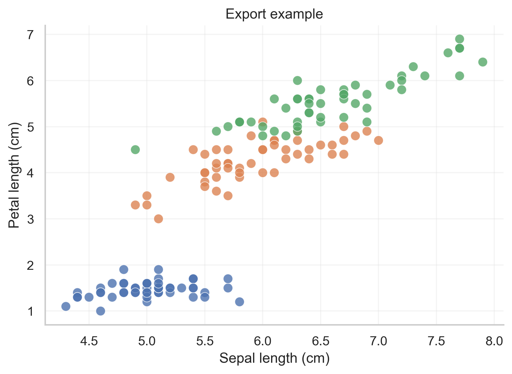
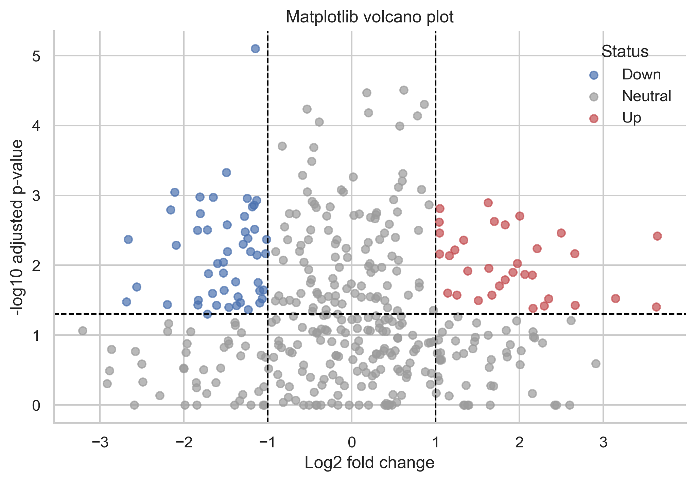

# Plotly Notes

Plotly is the most useful library in this project when interactivity matters.
If you want hover labels, zooming, panning, clickable legends, or HTML export, Plotly is usually the best choice.

The beginner-friendly part of Plotly is that you can start with Plotly Express and then gradually learn how to edit the resulting figure.

## The Beginner Mental Model

Use this two-step model:

1. create the plot with Plotly Express
2. improve it with `update_layout(...)`, `update_traces(...)`, or `add_annotation(...)`

```python
fig = px.scatter(
    iris,
    x="sepal_length",
    y="petal_length",
    color="species",
    template="plotly_white",
)
fig.update_layout(
    title="Interactive iris scatter plot",
    xaxis_title="Sepal length (cm)",
    yaxis_title="Petal length (cm)",
)
fig.show()
```

What this means:

- `px.scatter(...)` makes the first version quickly.
- `update_layout(...)` improves labels, title, size, and theme.
- the object stored in `fig` can still be changed after creation.

## Plotly Express vs Graph Objects

| Tool | What it is | When beginners should use it |
| --- | --- | --- |
| `plotly.express` (`px`) | High-level plotting interface | Start here for most charts |
| `plotly.graph_objects` (`go`) | Lower-level figure building blocks | Use when you need more control or subplots |

Simple rule:

- if Plotly Express can make the chart directly, use it first
- switch to `graph_objects` only when you need something more custom

## The One Pattern to Learn First

```python
fig = px.line(
    line_data,
    x="year",
    y="passengers",
    color="month",
    markers=True,
    template="plotly_white",
    title="Plotly line plot",
)
fig.update_layout(xaxis_title="Year", yaxis_title="Passengers")
```

Why it works well:

- the dataframe and column names stay visible
- the color mapping is easy to read
- the layout update is explicit and easy to remember

## Most Important Plotly Express Functions

| Function | What it does | Good beginner use |
| --- | --- | --- |
| `px.scatter` | Interactive scatter plot | Numeric relationships |
| `px.line` | Interactive line plot | Time or ordered data |
| `px.bar` | Interactive bar chart | Category summaries |
| `px.histogram` | Interactive histogram | Distribution exploration |
| `px.box` | Interactive box plot | Category spread |
| `px.violin` | Interactive violin plot | Distribution shape |
| `px.imshow` | Matrix view | Heatmaps and correlations |

## Important Parameters

| Parameter | What it changes | Beginner explanation |
| --- | --- | --- |
| `color` | Grouping by color | Which group each point belongs to |
| `symbol` | Marker shape | Useful when color alone is not enough |
| `size` | Marker size | Encodes a third variable |
| `hover_data` | Extra fields on hover | Gives detail without cluttering the plot |
| `hover_name` | Main hover label | Makes point identity easy to read |
| `template` | Overall style | White background, fonts, spacing |
| `opacity` | Transparency | Helps with overlap |
| `facet_row`, `facet_col` | Multiple panels | Compare groups side by side |
| `error_y` | Vertical error bars | Uncertainty or spread |

### Code Example: Interactive Scatter Plot

```python
fig = px.scatter(
    iris,
    x="sepal_length",
    y="petal_length",
    color="species",
    hover_data=["sepal_width", "petal_width"],
    template="plotly_white",
)
fig.update_traces(marker=dict(size=10, opacity=0.8))
fig.update_layout(width=800, height=500)
```

What each line gives you:

- `hover_data` adds extra context without printing more text on the chart
- `update_traces(...)` styles the marks themselves
- `update_layout(...)` styles the whole figure



## Why Plotly Feels Different

Plotly is not just for making a picture. It is for making a figure object that can be explored.

That matters because users can:

- hover points
- zoom into dense regions
- hide or show groups from the legend
- save or share HTML output

For a beginner, this means Plotly is especially good during exploration.

## Plotly for Relationship Plots

Interactive scatter plots are one of the best places to start.

```python
fig = px.scatter(
    pca_embedding,
    x="pc1",
    y="pc2",
    color="target_name",
    template="plotly_white",
    title="Interactive PCA plot",
)
```

Good uses:

- PCA
- UMAP-like embeddings
- model metrics across folds
- gene expression volcano plots



Even though the saved image above is static, Plotly is especially strong for this kind of plot because hovering can reveal gene names and exact values.

## Plotly for Heatmaps and Bar Charts

### Heatmap

```python
fig = px.imshow(
    flights_pivot,
    color_continuous_scale="YlOrRd",
    aspect="auto",
    template="plotly_white",
)
```

Use this when:

- you want the matrix view plus interactivity
- readers may want to inspect exact cells on hover

### Bar chart with error bars

```python
fig = px.bar(
    error_summary,
    x="condition",
    y="mean_count",
    error_y="se_count",
    color="condition",
    template="plotly_white",
)
```

Use this when:

- you want an interactive summary chart
- you want uncertainty visible without more code

## Layout and Annotation Controls

Plotly usually separates plotting from polishing.

```python
fig.update_layout(
    title="Customized Plotly scatter plot",
    xaxis_title="Sepal length (cm)",
    yaxis_title="Petal length (cm)",
    legend_title_text="Species",
    font=dict(size=12),
)

fig.add_annotation(
    x=7.0,
    y=6.1,
    text="Interesting point",
    showarrow=True,
)
```

How to remember this:

- `update_layout(...)` changes the container around the data
- `update_traces(...)` changes the marks
- `add_annotation(...)` adds extra explanation

## Exporting Plotly Figures

Plotly has two export modes beginners should care about:

| Export type | Function | Best use |
| --- | --- | --- |
| Interactive HTML | `fig.write_html(...)` | Sharing interactive charts |
| Static image | `fig.write_image(...)` | Papers, slides, documents |

```python
fig.write_html("outputs/figures/my_plot.html")
fig.write_image("outputs/figures/my_plot.png")
```

In this project, a working interactive example was exported here:

- [Interactive Plotly HTML example](../outputs/figures/25_export_example_plotly.html)

## When Plotly is the Best Choice

Use Plotly when:

- you are exploring data
- you want hover-based detail
- you want to share HTML with collaborators
- you need interactive dashboards later

Prefer Matplotlib or Seaborn when:

- you mainly need static publication figures
- the final target is a paper figure with exact journal-style layout

## Common Beginner Mistakes

- Stopping after the first `px.*` call and never polishing the figure.
- Overloading hover text with too much information.
- Assuming an interactive chart automatically has good design.
- Using too many traces in one figure.
- Forgetting to export HTML when interactivity is the main benefit.

## Practice Suggestions

1. Make one `px.scatter` with `hover_data`.
2. Turn a static bar chart into a Plotly bar chart.
3. Add `update_layout(...)` to improve title and axes.
4. Add one annotation.
5. Export one chart to HTML.

## Official Documentation Links

- [Plotly Python documentation](https://plotly.com/python/)
- [Plotly Express overview](https://plotly.com/python/plotly-express/)
- [Creating and updating figures](https://plotly.com/python/creating-and-updating-figures/)
- [Hover text and formatting](https://plotly.com/python/hover-text-and-formatting/)
- [Static image export](https://plotly.com/python/static-image-export/)
