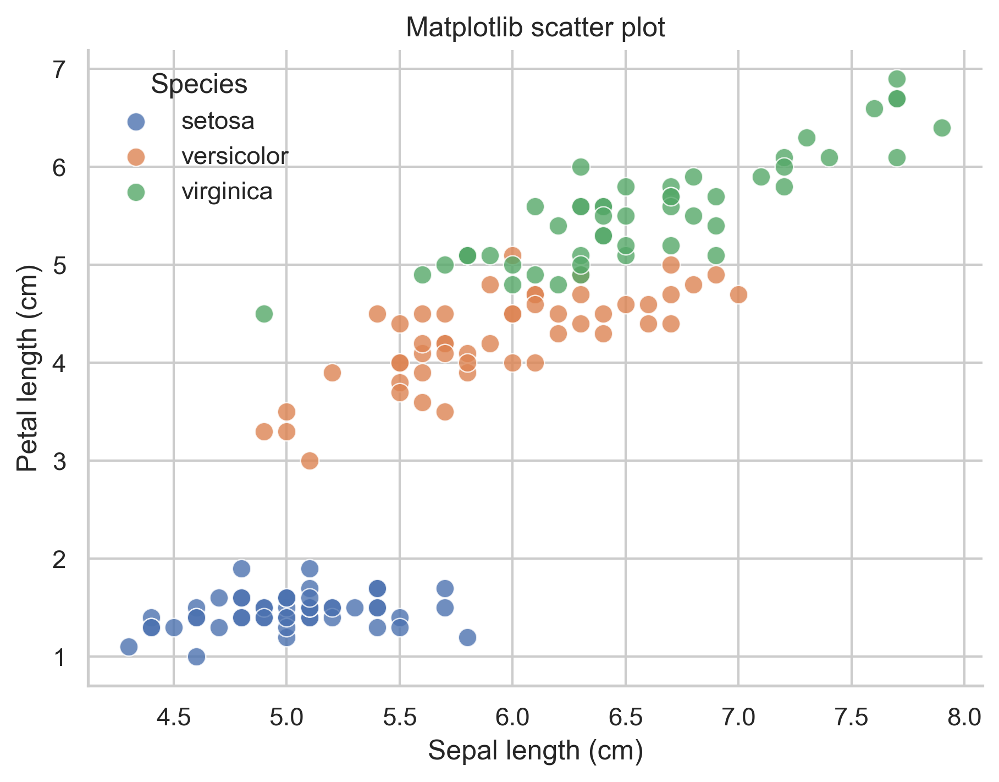

# Unique Parameters and Ideas by Library

Shared concepts help you get started, but each library also has its own style.
This file focuses on the features that feel most natural in one library and less natural in the others.

The easiest way to think about it is:

- Matplotlib gives you control
- Seaborn gives you tidy-data semantics
- Plotly gives you interactivity

## Matplotlib: Unique Strengths

| Unique idea | Why it matters |
| --- | --- |
| Artist model | Every visible object can be adjusted directly. |
| `rcParams` | You can set project-wide styling defaults. |
| `annotate` and transforms | Precise placement is easier than in most high-level APIs. |
| `twinx()` / `twiny()` | Convenient for paired axes when truly needed. |
| `constrained_layout` / `tight_layout()` | Better layout control for multi-panel figures. |

### Example: Project-wide Styling with `rcParams`

```python
plt.rcParams["figure.dpi"] = 120
plt.rcParams["savefig.dpi"] = 300
plt.rcParams["axes.spines.top"] = False
plt.rcParams["axes.spines.right"] = False
```

Why beginners should care:

- you stop fixing the same style choices over and over
- figures across a project become more consistent

### Example: Precise Annotation

```python
ax.annotate(
    "Peak holiday traffic",
    xy=(peak_row["year"], peak_row["passengers"]),
    xytext=(peak_row["year"] - 5, peak_row["passengers"] - 70),
    arrowprops={"arrowstyle": "->", "lw": 1.2},
)
```


Other ways you could use the same feature:

- label the most significant gene in a volcano plot
- call out an outlier in a scatter plot
- label the most successful model in a comparison chart

## Seaborn: Unique Strengths

| Unique idea | Why it matters |
| --- | --- |
| `hue`, `style`, `size` | Strong semantic mapping from data columns to visual meaning. |
| Figure-level APIs | `relplot`, `catplot`, and `displot` build whole multi-panel figures quickly. |
| Built-in statistical defaults | Several functions summarize data for you. |
| Theme helpers | `set_theme`, `despine`, and context settings improve appearance quickly. |
| Tidy-data bias | Works especially well when your dataframe is already well organized. |

### Example: Semantic Mapping

```python
sns.scatterplot(
    data=iris,
    x="sepal_length",
    y="petal_length",
    hue="species",
    style="species",
    s=85,
)
```

Beginner meaning:

- `hue` says which colors represent groups
- `style` says which marker shapes represent groups
- you describe the mapping directly instead of manually splitting the dataframe first



### Example: Figure-level Multipanel Layout

```python
g = sns.relplot(
    data=penguins.dropna(subset=["species", "bill_length_mm", "bill_depth_mm"]),
    x="bill_length_mm",
    y="bill_depth_mm",
    hue="sex",
    col="species",
    height=3.5,
    aspect=1,
)
```

This is useful when:

- you want repeated panels for groups
- the same chart should be compared across categories

## Plotly: Unique Strengths

| Unique idea | Why it matters |
| --- | --- |
| `hover_data` and `hover_name` | Adds detail without crowding the figure. |
| `template` | One setting can improve the whole chart style. |
| `update_layout(...)` and `update_traces(...)` | Separates creation from polishing. |
| `facet_row`, `facet_col` | Quick small-multiple interactivity. |
| `write_html(...)` | Easy sharing of interactive figures. |
| `animation_frame` | Allows animated data stories when needed. |

### Example: Hover-based Detail

```python
fig = px.scatter(
    volcano,
    x="log2_fc",
    y="neg_log10_adj_p",
    color="status",
    hover_name="gene",
    hover_data=["mean_expression", "adj_p_value"],
    template="plotly_white",
)
```

Why this is uniquely useful:

- the static plot stays clean
- exact values are still available when needed

### Example: HTML Export

```python
fig.write_html("outputs/figures/volcano_plot.html")
```

This matters because:

- collaborators can open the result in a browser
- interactivity survives outside the notebook

Related project output:

- [Interactive Plotly export example](../outputs/figures/25_export_example_plotly.html)

## Same Goal, Different Natural Home

Here are a few tasks and the library that feels most natural for each:

| Goal | Most natural library | Why |
| --- | --- | --- |
| Exact publication layout | Matplotlib | Fine-grained control |
| Fast grouped exploratory plots | Seaborn | Tidy-data semantics |
| Interactive exploration and HTML sharing | Plotly | Hover, zoom, HTML export |

## How Beginners Should Use This File

Do not try to use every unique feature at once.

A good learning order is:

1. learn the common concepts first
2. learn Matplotlib's figure/axes model
3. learn Seaborn's `hue` and tidy dataframe style
4. learn Plotly's `update_layout` and HTML export

## Official Documentation Links

- [Matplotlib style and customization](https://matplotlib.org/stable/users/explain/customizing.html)
- [Seaborn properties and semantic mappings](https://seaborn.pydata.org/tutorial/properties.html)
- [Seaborn function overview](https://seaborn.pydata.org/tutorial/function_overview.html)
- [Plotly creating and updating figures](https://plotly.com/python/creating-and-updating-figures/)
- [Plotly Express overview](https://plotly.com/python/plotly-express/)
