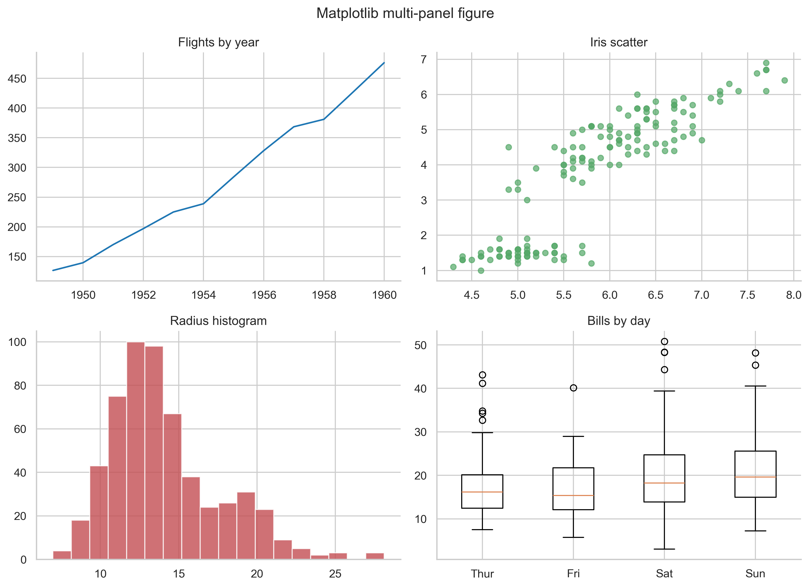

# Publication Quality Checklist

Publication quality does not mean making a plot fancy.
It means making a plot clear, honest, readable, and export-ready.

Use this checklist before you decide a figure is finished.

## See the Difference First

The example below is useful because it shows the same figure before and after polishing.


What changed:

- the polished version has a clearer title
- axes are labeled
- styling supports the data instead of distracting from it
- the key point is annotated

## Stage 1: Before You Polish Anything

Check the foundation first.

- Are the correct columns being plotted?
- Are the x-axis and y-axis what you intended?
- Are missing values being handled properly?
- Is the category order meaningful?
- Is the plot type appropriate for the question?

Beginner advice:

- never polish the wrong plot
- make sure the logic is correct before changing colors and fonts

## Stage 2: Message Check

Ask whether the figure says one main thing clearly.

- Can a reader understand the main message in 5 to 10 seconds?
- Does the title help the reader know what to look at?
- Is there one obvious takeaway?
- If there are several panels, do they support the same story?

Better title pattern:

- `Mean T-cell count increases after treatment`

Weaker title pattern:

- `T-cell count`

## Stage 3: Axis and Label Check

A strong figure usually has simple, careful labeling.

- Are both axes labeled?
- Are units included where relevant?
- Are tick labels readable?
- Are there too many decimals?
- Are axis limits fair and not misleading?

```python
ax.set_xlabel("Petal length (cm)")
ax.set_ylabel("Count")
ax.tick_params(labelsize=10)
ax.set_xlim(4, 8)
```

Why these lines matter:

- labels tell the reader what is being measured
- tick control helps readability
- sensible limits prevent wasted space or distortion

## Stage 4: Visual Design Check

A plot should feel intentional, not overloaded.

- Are fonts readable at the final size?
- Are line widths visible but not heavy?
- Are marker sizes large enough to see but small enough to avoid clutter?
- Is the color palette consistent and accessible?
- Are grid lines subtle?

```python
ax.grid(alpha=0.2, linestyle="--")
ax.scatter(x, y, s=70, alpha=0.7, edgecolor="white", linewidth=0.5)
```

Simpler explanation:

- strong data, quiet styling

## Stage 5: Legend and Annotation Check

- Does the legend explain something useful?
- Could the plot work without the legend?
- Is any annotation necessary and placed clearly?
- Does annotation highlight a real finding rather than repeat the title?

```python
ax.legend(frameon=False, title="Species")
ax.annotate("Peak value", xy=(x_peak, y_peak), xytext=(x_peak - 1, y_peak - 20))
```

Use annotations when:

- a specific point matters
- a trend shift matters
- an unusual outlier matters

Do not annotate everything.

## Stage 6: Multi-panel Figure Check

If the figure has several panels:

- are the panels aligned cleanly?
- are similar panels using similar scales?
- is there enough whitespace?
- are panel titles or labels consistent?



Good beginner rule:

- if two panels are meant to be compared directly, shared or consistent scales are usually better

## Stage 7: Uncertainty and Summary Check

This is especially important for means, model results, and biology-style summaries.

- If there are error bars, what do they mean?
- Are you showing SD, SE, or confidence interval?
- Should raw points also be shown?
- Is a bar plot hiding too much variability?


Better question to ask:

- does the reader see both the summary and how uncertain it is?

## Stage 8: Export Check

Choose the format based on the destination.

| Destination | Good format | Why |
| --- | --- | --- |
| Notebook or slides | PNG | Easy to view anywhere |
| Web or vector editing | SVG | Crisp lines and text |
| Paper or print workflow | PDF | Strong vector support |
| Interactive sharing | HTML | Hover and zoom remain available |

```python
fig.savefig("outputs/figures/final.png", dpi=300, bbox_inches="tight")
fig.savefig("outputs/figures/final.svg", bbox_inches="tight")
fig.savefig("outputs/figures/final.pdf", bbox_inches="tight")
```

```python
fig.write_html("outputs/figures/final_interactive.html")
```

Related project exports:

- [PNG example](../outputs/figures/25_export_example.png)
- [SVG example](../outputs/figures/25_export_example.svg)
- [PDF example](../outputs/figures/25_export_example.pdf)
- [Interactive HTML example](../outputs/figures/25_export_example_plotly.html)

## Stage 9: Final Outside-the-Notebook Check

Always inspect the saved file itself.

- Is any text cut off?
- Is the font size still readable?
- Does the figure look too small when pasted into slides or docs?
- Does the plot still make sense when viewed alone, without the notebook around it?

This step matters because notebooks often make figures look better than the final exported file actually is.

## A Fast Final Checklist

- Correct plot type
- Correct columns
- Clear title
- Clear axis labels
- Readable ticks
- Meaningful legend
- Accessible color choices
- Honest uncertainty
- Clean export
- Saved file inspected

## Official Documentation Links

- [Matplotlib savefig documentation](https://matplotlib.org/stable/api/_as_gen/matplotlib.pyplot.savefig.html)
- [Seaborn tutorial](https://seaborn.pydata.org/tutorial.html)
- [Plotly static image export](https://plotly.com/python/static-image-export/)
