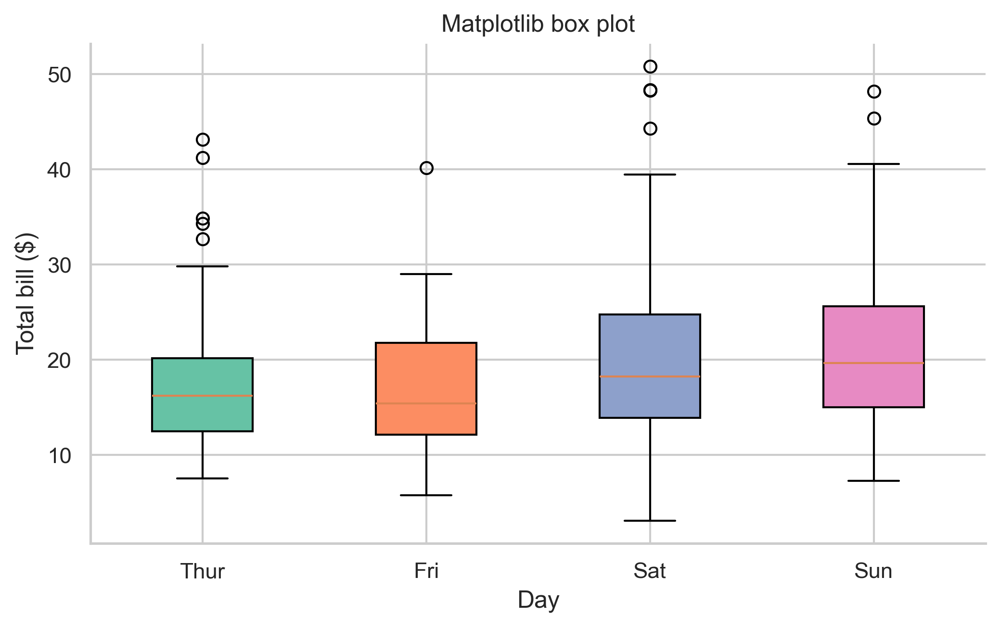
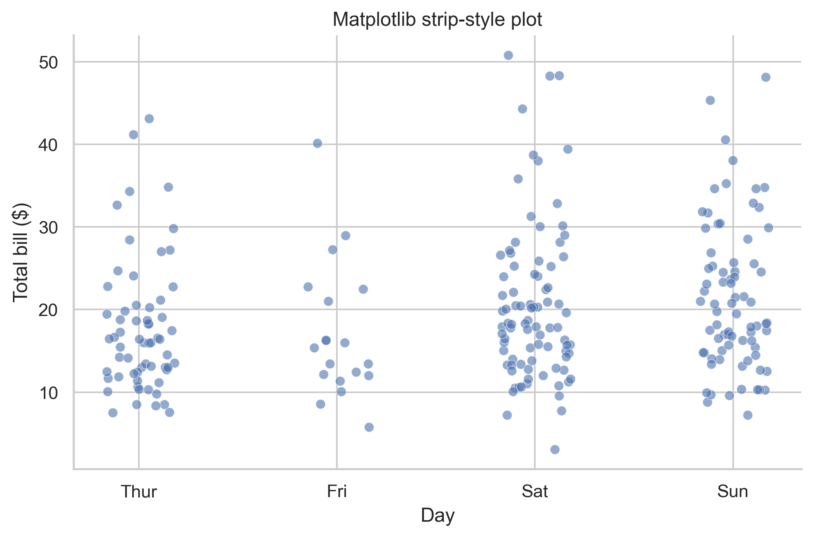
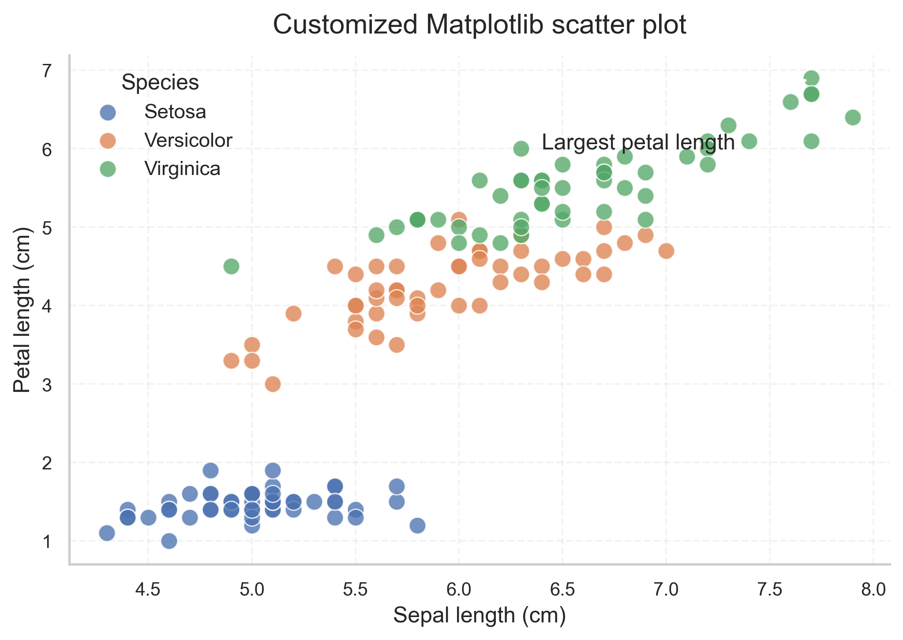
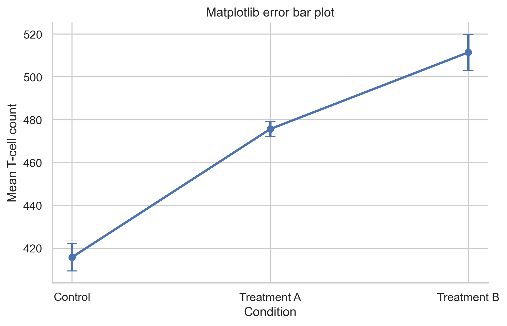
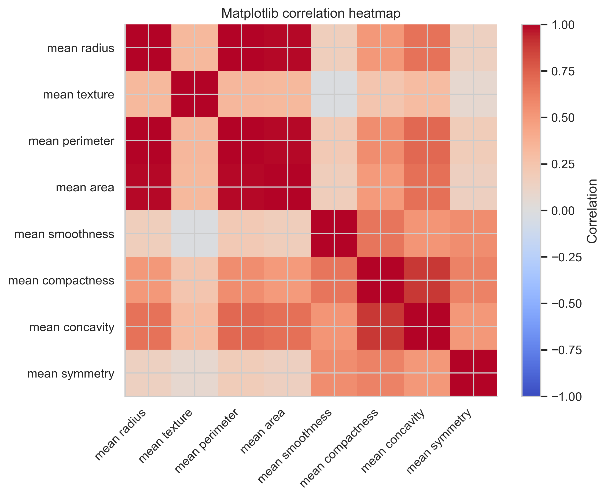

# Common Plotting Mistakes and Practical Fixes

Most plotting mistakes come from communication problems, not syntax problems.
A plot can run without errors and still be a weak figure.

Use this file as a troubleshooting guide when a plot feels confusing or unconvincing.

## Quick Table of Common Mistakes

| Mistake | Why it hurts | Better fix |
| --- | --- | --- |
| Using bars for raw distributions | Bars hide spread and outliers. | Use box, violin, strip, or swarm plots. |
| Too many colors | The viewer cannot track the mapping. | Limit colors to meaningful groups. |
| Missing units on axes | Readers cannot interpret scale. | Add units directly to labels. |
| Crowded legends | Legends become a reading task. | Reduce groups or label directly. |
| Overplotting in scatter plots | Dense regions disappear. | Use alpha, smaller markers, or summaries. |
| Default export DPI | Saved figures look soft in slides or print. | Export raster figures at 300 DPI or higher. |
| Unexplained error bars | Readers do not know what uncertainty means. | State SD, SE, or CI clearly. |
| Too many decimals | Extra precision adds noise. | Round to what the audience needs. |
| Accidental alphabetical order | Story and comparison become weaker. | Set a meaningful category order. |
| Using interactivity instead of design | Hover does not fix a weak figure. | Make the static logic clear first. |
| Cluttered titles | The reader gets no clear takeaway. | Write one simple message-focused title. |
| Cropped or misleading axis limits | The visual impression becomes distorted. | Set limits carefully and honestly. |

## Mistake 1: Using a Bar Plot When You Really Need a Distribution Plot

A bar plot is fine for a clean summary.
It is weak when the actual spread matters.

Better alternatives:

- box plot
- violin plot
- strip or swarm plot

```python
# Better than a plain mean bar chart when you care about spread:
sns.boxplot(data=tips, x="day", y="total_bill")
sns.swarmplot(data=tips, x="day", y="total_bill", color="black", size=3)
```





Beginner shortcut:

- if you are about to use a bar plot, ask whether a box plot would be more honest

## Mistake 2: Overplotting in Scatter Plots

When many points overlap, dense regions become unreadable.

Practical fixes:

- reduce point size
- lower alpha / opacity
- use binning or summaries for very large datasets

```python
ax.scatter(x, y, s=35, alpha=0.5)
```

Why this helps:

- smaller points reduce clutter
- transparency makes dense regions visible



## Mistake 3: Weak Titles and Labels

Plot code often works before the explanation is good enough.

Weak:

- `Title = "Plot"`
- `ylabel = "value"`

Better:

- `Title = "Mean T-cell count increases after treatment"`
- `ylabel = "Mean T-cell count"`

```python
ax.set_title("Mean T-cell count increases after treatment")
ax.set_xlabel("Condition")
ax.set_ylabel("Mean T-cell count")
```

Beginner rule:

- titles tell the story
- axis labels tell the measurement

## Mistake 4: Forgetting What Error Bars Mean

Error bars are easy to add and easy to misuse.

Always ask:

- is this SD, SE, or CI?
- is the reader told that clearly?

```python
ax.errorbar(
    error_summary["condition"],
    error_summary["mean_count"],
    yerr=error_summary["se_count"],
    fmt="o-",
    capsize=5,
)
```



Better explanation in a caption or note:

- "Points show the mean. Error bars show standard error."

## Mistake 5: Using Too Many Categories at Once

Too many groups break:

- legend readability
- color distinction
- viewer attention

Better fixes:

- show fewer groups
- facet into smaller panels
- use direct labels if only a few groups matter

```python
g = sns.relplot(data=df, x="x", y="y", hue="group", col="group")
```

This works better than one overloaded panel when group count grows.

## Mistake 6: Bad Category Order

Alphabetical order is often accidental, not meaningful.

Better ordering examples:

- natural time order
- biological stage order
- treatment order
- sorted by median or mean when appropriate

```python
tips["day"] = pd.Categorical(tips["day"], categories=["Thur", "Fri", "Sat", "Sun"], ordered=True)
```

Why this matters:

- the eye follows order naturally
- a meaningful sequence supports the message

## Mistake 7: Using a Fancy Color Map Without Meaning

Color should help interpretation, not just decoration.

Better practice:

- use categorical palettes for groups
- use sequential colormaps for magnitude
- use diverging colormaps when zero or a midpoint matters

```python
sns.heatmap(corr_matrix, cmap="coolwarm", center=0)
```



Simpler explanation:

- if low-to-high magnitude is the story, use a sequential scale
- if negative-to-positive is the story, use a diverging scale

## Mistake 8: Exporting Only the Notebook View

A notebook preview is not the final deliverable.

Better:

```python
fig.savefig("outputs/figures/final_plot.png", dpi=300, bbox_inches="tight")
fig.savefig("outputs/figures/final_plot.svg", bbox_inches="tight")
```

Why this matters:

- exported files reveal clipped text and scaling issues
- final consumers rarely see the notebook itself

## Mistake 9: Treating Interactivity as a Substitute for Clarity

Plotly hover is useful, but a confusing plot remains confusing.

Better approach:

- make the static structure clear first
- then add hover detail

```python
fig = px.scatter(df, x="x", y="y", color="group", hover_data=["extra_column"])
fig.update_layout(title="Clear title first, hover second")
```

## Mistake 10: Over-polishing Before Checking the Data Logic

This is a workflow mistake rather than a visual one.

Wrong order:

1. choose colors
2. pick fonts
3. add annotations
4. only later realize the wrong column was plotted

Better order:

1. inspect data
2. make rough plot
3. confirm the logic
4. then polish

## A Better Debugging Routine for Plots

When a plot feels wrong:

1. Check the dataframe and column names.
2. Check missing values.
3. Check category order.
4. Check axis labels and units.
5. Check whether the chosen plot type really answers the question.
6. Only then adjust style.

## Good Examples from This Project

Use these figures as references for cleaner choices:

- [Scatter plot example](../outputs/figures/06_scatter_plot.png)
- [Heatmap example](../outputs/figures/14_heatmap.png)
- [Volcano plot example](../outputs/figures/20_volcano_plot.png)
- [Publication-quality example](../outputs/figures/24_publication_quality.png)

## Official Documentation Links

- [Matplotlib user guide](https://matplotlib.org/stable/users/index.html)
- [Seaborn tutorial](https://seaborn.pydata.org/tutorial.html)
- [Plotly Python documentation](https://plotly.com/python/)
